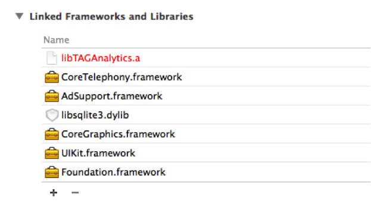

# 开始

本篇主要介绍了在iOS操作系统中导入Analytics SDK的方法。为了使用Analytics SDK系统，必须先注册APP。APP的注册方法，请参考此链接（http://cloud.toast.com/documents/2/）。 
** 有关活动关联内容将另附文档。在本文中只讲述了如何体现客户端的内容，具体内容请参考“活动关联指南”。**

# 项目设置

## SDK下载

在http://cloud.toast.com/documents/6/中下载Android SDK文档。

## 项目设置

### 依赖库（Library dependency）设置
把下载的TAGAnalytics.h文档包含在项目当中，并将libTAGAnalytics.a文档添加到“Linked Frameworks and Libraries”中，同时也添加“AdSuppert.framework”, “libsqlite3.dylib”, “CoreTelephony.framework”。



## iOS9 ATS设置
从iOS9起添加 ATS(App Transport Security)功能。
对从应用访问至 http,https的域名需要相关设置。
这只支持XCode7以上的版本。关于详细事宜，请参考Apple文件。
(https://developer.apple.com/library/prerelease/ios/technotes/App-Transport-Security-Technote/)

将在Toast Analytics访问以下两个域名。
- *.toast.com : 记录收集服务器
- *.toastoven.net : Campaign所使用的图像服务器

对应用的 Info.plist需添加如下内容。

```
<key>NSAppTransportSecurity</key>
<dict>
	<key>NSExceptionDomains</key>
	<dict>
		<key>toastoven.net</key>
		<dict>
			<key>NSExceptionRequiresForwardSecrecy</key>
			<false/>
			<key>NSExceptionAllowsInsecureHTTPLoads</key>
			<true/>
			<key>NSIncludesSubdomains</key>
			<true/>
		</dict>
		<key>toast.com</key>
		<dict>
			<key>NSExceptionRequiresForwardSecrecy</key>
			<false/>
			<key>NSExceptionAllowsInsecureHTTPLoads</key>
			<true/>
			<key>NSIncludesSubdomains</key>
			<true/>
		</dict>
	</dict>
</dict>
```

如欲许可所有域名的访问，就不用添加上面内容，而添加下面内容。

```
<key>NSAppTransportSecurity</key>
<dict>
    <key>NSAllowsArbitraryLoads</key>
    <true/>
</dict>
```

# 必须关联的接口
这是为了收集基本统计数据，必须要关联的API接口。仅体现必须关联的项目，也可以看到大致的数据。

必须关联的项目如下：
* 初始化 : initializeSDK
* 会话跟踪 : traceActivation, traceDeactivation
* 购买 (In App Purchase) : tracePurchase
* 获得/使用虚拟货币 : traceMoneyAcquisition, traceMoneyConsumption
* 升级 : traceLevelUp
* 好友数 : traceFriendCount

## 初始化

为了使用SDK，需要有注册APP之后发放的“APP认证密钥”和“企业账号”。注册APP的方法，请参考此链接（http://cloud.toast.com/documents/2/）。


为了使用GameAnalytics SDK，必须先进行SDK的初始化。<br>
GameAnalytics类initializeSDK函数是指进行SDK初始化的函数，该函数主要进行内部所需数据（设备信息、APP设置信息）的确认及传送日志所需环境的设置。
```
- (BOOL)application:(UIApplication *)application didFinishLaunchingWithOptions:(NSDictionary *)launchOptions
{
  ……
  [TAGAnalytics initializeSdk:@"AppKey"
			        companyId:@"CompanyID"
			       appVersion:@"AppVersion"
		     useLoggingUserId:NO];
  ……
}
```

### 设定区分用户的基准
** 在运营过程中若变更区分用户的基准，将会断开变更前/后数据的关联关系，因此在游戏上线之后，尽量不要变更此基准。**<br>
Analytics作为区分用户的基准，将会使用Advertise ID或User ID，但是这两个ID不允许同时使用，而是根据游戏政策，需要做出二者选一。<br>
一般情况下，都是以Advertise ID作为使用基准的，但是如果在游戏里有特殊要求，也可以把User ID作为使用基准。<br>
例如，使用Advertise ID在同一台设备中进行账号关闭->重新加入时，被视为同一用户；相反，如果使用User ID时，则被视为新注册用户。<br> 
或者一名用户在使用两部设备的情况下，如果使用Advertise ID，被视为不同用户；相反，如果使用User ID，则被视为一名用户。 <br>
因为涉及到这一部分内容，所以在游戏中需要先确定好使用基准。<br>
可以将初始化函数（initializeSDK）的最后因子（use logging userid flag）设为该值。当Flag值为true时，将User ID <br>
下面代码就是将User ID作为区分用户使用基准的情况。<br>
```
- (BOOL)application:(UIApplication *)application didFinishLaunchingWithOptions:(NSDictionary *)launchOptions
{
  ……
  int result = [TAGAnalytics initializeSdk:@"AppKey"
		            			 companyId:@"CompanyID"
					            appVersion:@"AppVersion"
				          useLoggingUserId:YES];
  if (result != 0) {
	 // Initialize Fail
  }

  // 在游戏里完成登录处理
  ……
  // 把User ID作为区分用户的使用基准时，注册User ID的函数。
  [TAGAnalytics setLoggingUserId:@"user id"];
……
}
```

将初始化函数的最后因子（use logging userid flag）设为true时，必须要先调用setLoggingUserId后，再注册User ID。把Flag值设为true之后，如果不调用setLoggingUserId，会致使以后调用的所有API以失败（E_LOGGING_USER_ID_EMPTY）返回。<br>
在setUserId中，“useCampaignOrPromotion”是在使用推广或活动的情况下才是true，否则是false。 <br>
当调用完initializeSDK之后，因成功登录游戏而获得了可在游戏中使用的userID后，方可调用setUserId函数。userID可以使用在游戏中用以区分用户的值。<br>
有关Advertise ID的内容，请参考以下链接：<br> 
https://developer.apple.com/LIBRARY/ios/documentation/AdSupport/Reference/ASIdentifierManager_Ref/index.html

## 会话跟踪

为了跟踪DAU（Daily Active User）和游戏滞留时间需要关联的项目。<br> 
当开始/结束App、移到后台（Background）/前台（Foreground）时，可以调用并测量与该动作相符的API。<br>
初次运行App（initializeSDK之后）或从后台（background）移到前台（foreground）时，调用traceActivation来进行会话跟踪，然后待App进入到后台时，再调用traceDeactivation来停止会话跟踪。<br>
如果调用traceDeactivation，就可以计算出traceActivation和traceDeactivation之间的时间，以此来测出游戏时间，并且SDK内部运行的程序，也将在traceDeactivation命令中被中止。<br>
移到后台/前台时，如果不调用上述函数，就无法测出准确的游戏时间，因此必须要调用此API。<br>
DAU通常去除一日之内重复调用 traceActivation的用户数（以Advertise ID或User ID为基准）后进行统计。

```
- (void)applicationWillResignActive:(UIApplication *)application
{
	[TAGAnalytics traceDeactivation];
}

- (void)applicationDidBecomeActive:(UIApplication *)application
{
	[TAGAnalytics traceActivation];
}
```

## 行为跟踪

可以跟踪用户对In-App Purchase、获得/使用虚拟货币、升级和好友数变更等行为。

### 1. In-App Purchase

发生In-App Purchase之后，才能调用tracePurchase来传送购买信息。<br>
Currency将使用在ISO-4217(http://en.wikipedia.org/wiki/ISO_4217)中自定义的代码。<br>
如购买$0.99钻石时，将按如下步骤进行操作： <br>
（这里的“GEM_10”是指游戏中自定义的道具代码，而Unit Cost是指该道具的单位价格，Payment是指用户实际发生的费用，Level应输入已购买用户的级别。）

```
[TAGAnalytics tracePurchase:@"GEM_10"
                    payment:0.99
                   unitCost:0.99
                   currency:@"USD"
                      level:10];
```

### 2. 虚拟货币的获得和使用
在游戏中获得并使用虚拟货币时，才可以调用此选项，且可以跟踪一次和二次虚拟货币数量的变化。一般来说，一次虚拟货币是指通过In-App Purchase购买的虚拟货币（ex.钻石、红钻等）；二次虚拟货币是指使用一次虚拟货币购买的虚拟货币（ex. 樱桃、爱心等）。<br>
通过IAP购买10颗钻石时，将按如下步骤进行操作：<br>
（“CODE_IAP”是指游戏中自定义的代码，如一次虚拟货币时，Type为0，而二次虚拟货币是1）

```
[TAGAnalytics traceMoneyConsumption:@"CODE_IAP"
	                           type:@"0"
                  consumptionAmount:10
	                          level:10];
```

使用10颗钻石购买100个樱桃时，将按如下步骤进行操作：

```
// 使用一次虚拟货币
[TAGAnalytics traceMoneyConsumption:@"CODE_USE_GEM"
				               type:@"0"
		          consumptionAmount:10
				              level:10];

// 获得二次虚拟货币
[TAGAnalytics traceMoneyAcquisition:@"CODE_BUY_CHERRY"
				               type:@"0"
		          consumptionAmount:10
				              level:10];
```

使用一次虚拟货币购买二次虚拟货币时，将会出现‘一次虚拟货币减少’->‘二次虚拟货币增加’的情况。但是为了购买二次虚拟货币而使用了一次虚拟货币时，如果不想判定为是额外支付，也可以单传送‘获得二次虚拟货币’的日志。

### 3. 升级
用户级别出现变更时，将调用traceLevelUp。需要注意的是大部分的行为跟踪API，为了跟踪到各级别的行为，需要同时接收用户的级别。<br>
当用户级别变为10时，将按如下步骤进行调用，这时该用户的级别必须要提升，若降低，则无法测出准确的数据。<br>
例如，像《糖果传奇》（Candy Crush Sage）一样用关卡表示级别的游戏中，只需要在最初进入该关卡时保留升级Log即可，如果返回到以前的关卡进行游戏时，则无需保留升级log。<br>
并且向其他API传送的级别值也应该使用用户的最高关卡值，而不是当前进行的关卡值。

```
[TAGAnalytics traceLevelUp:10];
```

### 4. 好友
表示注册用户的好友数。通常运行APP之后，待好友信息完成加载完成时，即可调用。

```
[TAGAnalytics traceFriendCount:100]; 
```

# 选择关联的接口

本内容主要讲述了在游戏中除了通过基本接口所提供的指标以外，还有追加测量的指标和在Analytics应用中所提供的活动功能的使用方法。

选择关联的项目如下：
* 活动（Campaign）连接 : setCampaignListener, (show/hide)Campaign
* 收集自定义事件（Custom Event）: traceEvent
* 测量所需时间 : traceStartSpeed, traceEndSpeed

## 活动（Campaign）关联

### 1. 事先做好活动关联准备
有关活动关联及执行内容，将另附指南。<br>
请参考Toast Analytics中“活动执行”菜单里的“页面指南”吧。
(http://analytics.toast.com/promotion/share/document/4.2_Campaign_run.pdf)

### 2. 联动推送
为在Analytics SDK使用推送进行宣传活动，应使用 Toast Cloud Push。
关于使用推送的详细内容，请参考 Toast Cloud Push提供的 “Client SDK Guide”。
http://cloud.toast.com/documents/18/?content_id=145
```
- (BOOL)application:(UIApplication *)application didFinishLaunchingWithOptions:(NSDictionary *)launchOptions
{
  ……
  // SDK初始化
  [TAGAnalytics initializeSdk:@"AppKey"
                    companyId:@"CompanyID"
                   appVersion:@"AppVer"
             useLoggingUserId:NO];
  ……

  // 如在Toast Cloud Push成功注册好推送token，应将注册token的用户ID转发到 Toast Analytics。
  // 此时将使用 [TAGAnalytics setPushUserId]。
  [TCPushSdk registerWithAppKey:@"your_app_key" userId:@"your_userid" onRegister:^(int error) {
    if (error == 0) {
      [TAGAnalytics setPushUserId:@"your_userid"]
    }
  } options:options];

  ....

}

- (void)application:(UIApplication *)application didReceiveRemoteNotification:(NSDictionary *)userInfo
{
  [TAGAnalytics setPushData:userInfo];
}

```

### 3. 创建及注册活动监听器
SDK定期与活动服务器连接后，将获取与活动及奖励相关的信息。如果当前用户有要进行的活动或获得的奖励信息时，将通过TAGCampaignDelegate发送通知。<br>
另外，为了获得活动信息，需要创建TAGCampaignDelegate 。

```
@protocol TAGCampaignDelegate <NSObject>
-(void)analyticsDidMissionComplete:(NSArray*)missionList;
-(void)analyticsDidCampaignVisibilityChange:(NSString*)adspaceName show:(BOOL)show;
-(void)analyticsDidCampaignLoadSuccess:(NSString*)adspaceName;
-(void)analyticsDidCampaignLoadFail:(NSString*)adspaceName errorCode:(int)errorCode 
  errorMessage:(NSString*)errorMessage;
-(void)analyticsDidCampaignClick:(NSString*)callbackInfo;
-(void)analyticsDidPromotionVisibilityChanged:(BOOL)show;
@end
```

出现如下情况时，可以调用下列回调函数（ Callback）：
* analyticsDidCampaignVisibilityChange：调用showCampaign、hideCampaign之后，当出现或消失与活动相关的弹窗和横幅时，就会被调用。
* analyticsDidMissionComplete: 用户进行活动/推广（Promotion）的同时，完成了指定任务而需要发送奖励信息时，就会被调用，并借助在此获得的信息，通过游戏服务器向用户发放奖励。与活动奖励相关的进程，请参考“活动应用指南”。
* analyticsDidCampaignLoadSuccess, analyticsDidCampaignLoadFail: 它将通知在服务器中获取到的活动信息的分析（Parsing）结果。在游戏里无需特殊处理该回调函数（Callback），它只是为了确认log而提供的回调函数罢了。
创建的TAGCampaignDelegate，将通过setCampaignDelegate进行注册。
* analyticsDidCampaignClick : 是链接选项选择Deeplink的话，即为传递登录字符串的CALLBACK。 参考所接收的字符串在游戏中对所希望进行的动作进行处理。
* analyticsDidPromotionVisibilityChange: 目前在iOS还不能使用。
```
- (void)viewDidLoad {
  ……
  [TAGAnalytics setCampaignDelegate:self];
  ……
}

……

-(void)analyticsDidMissionComplete:(NSArray *)missionList
{
  // missionList Array作为NSString字符串，等同于mission string。
  // mission string中， key/value的信息将以分割符‘|’出现。
  // 通过游戏服务器在推广服务器（promotion server）中验证其值后，向用户
  // 发放奖励。
}

- (void)analyticsDidCampaignVisibilityChange:(NSString *)adspaceName show:(BOOL)show
{
  // 横幅、弹窗的Visibility Change
}

- (void)analyticsDidCampaignLoadSuccess:(NSString *)adspaceName
{
  // for Debugging
}

- (void)analyticsDidCampaignLoadFail:(NSString *)adspaceName errorCode:(int)errorCode errorMessage:(NSString *)errorMessage
{
  // for Debugging
}

-(void)analyticsDidCampaignClick:(NSString*)callbackInfo;
{
  // 是链接选项选择Deeplink的话，即为传递登录字符串的CALLBACK。
  // 参考所接收的字符串在游戏中对所希望进行的动作进行处理。（预计事后公布）
}
```

### 4. 活动的展示（Show）/隐藏（Hide）
是指当前用户若有正在进行的活动时，向该用户展示在Analytics网站注册的活动弹窗/横幅的同时，将已展示的弹窗/横幅隐藏的一种方法（Method）。参数adspaceName，可以使用在Analytics网站注册时使用的adspace名称。这里的Adspace是指游戏内展示弹窗/横幅的特定位置。<br>
如果活动中不使用adspace，showCampaign() Method将不会启动，所以先确定好游戏内可出现活动弹窗/横幅的几个地点后，以不同的adspaceName调用函数的话，可以不经过游戏客户端的修改，游戏运营人员也可以通过在Analytics网站自行注册活动这一步骤，将弹窗/横幅展示给用户。注册Adspace的方法，请参考“活动测试指南”。
```
+(int)showCampaign:(NSString*)adspaceName parent:(UIView*)parent;
+(int)showCampaign:(NSString*)adspaceName parent:(UIView*)parent animation:(int)animation 
  lifeTime:(int)lifeTime;
+(int)hideCampaign:(NSString*)adspaceName;
+(int)hideCampaign:(NSString*)adspaceName animation:(int)animation;
```
## 自定义事件（Custom Event）的使用

需要给各游戏进行定义和分析特定事件时使用。<br>
例如，使用Fever Time Item时，将按如下步骤进行操作。使用的所有代码，在游戏中自定义后使用。下面示例是在特定关卡中，为了跟踪道具变动内容而自定义的代码。
```
[TAGAnalytics traceEvent:@"ITEM"
               eventCode:@"ITEM_USE"
                  param1:@"FEVER"
                  param2:@"STAGE_10"
                   value:1
                   level:10];
```

也可以在特定级别中跟踪与BOSS对战的结果时使用。
```
[TAGAnalytics traceEvent:@"STAGE"
               eventCode:@"STAGE_BOSS_VICTORY"
                  param1:@"DRAGON_VALLEY"
                  param2:@"BOSS_MOB"
                   value:1
                   level:10];
```

除此之外，还具有可跟踪游戏内特殊事件的多种用途。<br>
在traceEvent中使用的String Type参数（event type, event code, param1, param2），每个最多可用50个字节，而且在event下面有可能发生的param1最多为300个，在param1下面有可能发生的param2最多为200个。<br> 
Event Code必须要唯一。虽Event Type但Event code同意的话，查询时指标将为Sum，请在显示时予以注意。<br>
详细内容请参考Toast Analytics网站的指南。（点击Custom event页面右上角的“页面指南”，即可下载）

## 测量所需时间

可以测量特定区间所需时间。例如，不管是测量新手教程还是转换场景（Scene）时所需的时间，只要是需要测量时间的任何区间，都可以使用它。<br>
需要测量介绍场景（Intro Scene）的加载时间时，按如下步骤操作即可。“INTRO_LOADING”是指游戏内对特定区间自定义的值。
```
- (void) onStart() 
{
  [TAGAnalytics traceStartSpeed:@"INTRO_LOADING"];
}

- (void) onLoadCompleted() {
  [TAGAnalytics traceEndSpeed:@"INTRO_LOADING"];
}
```

## Facebook安装追踪

可追踪通过Facebook广告的应用安装。此功能将利用提供的
关系详细事宜及测试方法，请参考facebook提供的文件(https://developers.facebook.com/docs/app-ads/deep-linking)。
 fetchDeferredAppLink@FBSDKAppLinkUtility是Facebook SDK所提供的API。
 (https://developers.facebook.com/docs/reference/ios/current/class/FBSDKAppLinkUtility/)
 ```
[FBSDKAppLinkUtility fetchDeferredAppLink:^(NSURL *url, NSError *error) {
    if (url) {
        [TAGAnalytics traceFacebookInstall:url.query];
    }
}];}
```

# SDK设置

### 1. DEBUG模式的激活
在开发过程中，为了确认SDK日志（log），可以设置日志的输出与否。<br>
该函数在initializeSDK的之前/之后，都可以进行调用，基本值为setDebugMode(false)。
Log tags是以“Analytics:”开始的，如果在Eclipse中将logcat过滤器指定为“Analytics”，就可确认在SDK发生的日志。
```
- (void) Start () 
{
  ……
 [TAGAnalytics setDebugEnabled:YES];
  ……
}
```

激活DEBUG模式时，可以确认到传送日志的内容。传送完日志后，再确认其回复的日志，就可以确定日志是否传送无误。如果出现如下日志字符串，说明收集到的数据已正常传送到了服务器上。（***是根据情况会出现不同的值）
```
iOS : RequestWorkerThread::didReceiveResponse - <NSHTTPURLResponse: ***> { URL: *** } { status code: 200,
```

### 2. 设备（Device）信息的确认
可以确认在SDK获取到的设备信息。<br>
当前可以确认到设备账号、推送令牌和活动用户账号的值，这些都是联动测试活动时所需的值。详细内容请参考“活动连接指南”。 
```
void printDeviceInfo() 
{
  NSString *deviceID = [TAGAnalytics deviceInfoWithKey:DEVICE_INFO_DEVICEID];
  NSString *pushUserID = [TAGAnalytics deviceInfoWithKey:DEVICE_INFO_PUSH_UESR_ID];
  NSString *cUserID = [TAGAnalytics deviceInfoWithKey:DEVICE_INFO_CAMPAIGN_USERID];
  ……
}
```

### 3. SDK版本的确认
SDK版本可以通过“getVersion()” 函数进行确认。
```
[TAGAnalytics version];
```
