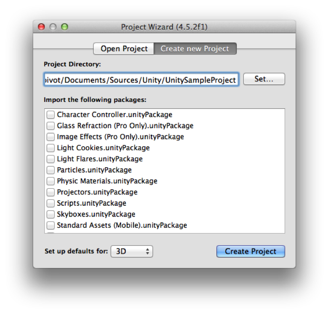
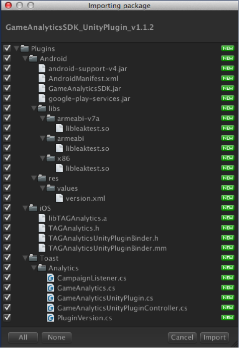
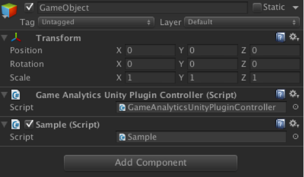
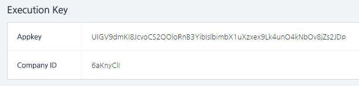

# 开始

该文档主要介绍了在Unity中导入Analytics SDK的方法。为了使用Analytics SDK，需要先注册APP。
注册APP的方法，请参考此链接（http://cloud.toast.com/documents/2/）。
- 该文档以Unity4版本为基准所编写的。
- 只有Pro版本才支持Unity插件程序功能，而且为了使用SDK Plugin，需要使用Unity Pro编程开发应用程序。
- 各操作系统所提供的Programming Guide中，将介绍有关Android Manifest和iOS Build设置等内容。
- 有关活动关联的内容将另附文档。在本文中只讲述了如何体现客户端的内容。具体内容请参考“活动关联指南”。


# 项目设置

## SDK下载

在http://cloud.toast.com/documents/6/ 中下载SDK。

## SDK 构成

下载完成后若解压缩包，就会有Unity Package文档和记录变更内容的README.txt文档。

```
	Analytics-SDK-Unity /
  - GameAnalyticsUnityPlugin.unitypackage 	// Analytics SDK Unity Package
  - README.txt                     // Release History
```

## 项目设置

#### 1. 项目生成
运行Unity3D来生成新的项目，如果已有生成的项目，将省略此步骤。



[图1 项目生成]

#### 2. 添加依赖项（Library）
在Unity3D菜单中，选择Assets >Import Package >Custom Package之后，把下载的Unity Package文档导入进去。

（如果google-play-services.jar, AndroidManifest.xml是游戏中已使用的版本或包含在其他依赖项中的文档，则无需添加。在“res”文件夹下面的内容也可以与google-play-services.jar一同删除。）

使用混淆器（Proguard）时，需要添加如下选项 。 "-keep public class com.toast.android.analytics.external.leaktest.MemoryInfo { public *;}")



[图2 添加依赖项]

#### 3. 游戏对象（Game Object）的生成
生成一个空白游戏对象后，将GameAnalyticsUnityPluginController添加到游戏对象的组件里去。



[图3 生成Game Object]

#### 4. 使用SDK
以后在游戏中找个适当的时机，调用行为跟踪API即可。<br />
在GameAnalytics.cs中，已经做出了行为跟踪API 的定义。

#### 5. OS追加设置 
分别按OS(Android, iOS) 进行项目设置以及在Manifest中要追加设置的选项。<br / >
详情请参考各OS所提供的编程指南（Programming Guide）中的项目设置选项。


# 必须关联的接口
为了收集基本的统计数据，必须要关联的API接口。只要创建好必须关联的项目，也可以查看大部分的数据。

必须关联的项目如下：
- 初始化 : initializeSDK
- 会话跟踪 : traceActivation, traceDeactivation
- 购买 (In App Purchase) : tracePurchase
- 获得/使用虚拟货币 : traceMoneyAcquisition, traceMoneyConsumption
- 升级 : traceLevelUp
- 好友数 : traceFriendCount


## 初始化

为了使用SDK，需要有注册APP之后发放的“APP认证密钥”和“企业账号”。注册APP的方法，请参考此链接 (http://cloud.toast.com/documents/2/)。



[图4 认证密钥信息]

为了使用GameAnalytics SDK，必须先进行SDK的初始化。<br />
GameAnalytics类的initializeSDK函数是指进行SDK初始化的函数，该函数主要进行内部所需数据（设备信息、APP设置信息）的确认和传送日志所需环境的设置。

```
using UnityEngine;
using System;
using System.Collections.Generic;
using Toast.Analytics;

public class Sample : MonoBehaviour {

    // Use this for initialization
    void Start () {

     ……

     int result = GameAnalytics.initializeSdk ("APPKEY", "COMPANYID", "VERSION", false);

     if (result != 0 ) {
        // SDK初始化失败
     }
     ……

     // 初始化之后，开始进行会话跟踪。
     GameAnalytics.traceActivation()
}
```


# 设定区分用户的基准
** 在运营过程中若变更区分用户的基准，将会断开变更前/后数据的关联关系，因此在游戏上线之后，尽量不要变更此基准。

Analytics作为区分用户的基准，将使用Advertise ID或 User ID，但是这两个ID不允许同时使用，而是根据游戏政策， 需要做出二者选一。<br />
一般情况下，都是以Advertise ID作为使用基准，但是如果在游戏里有特殊要求，也可以把User ID作为使用基准。<br />
例如，使用Advertise ID在同一台设备中进行删除账号->重新加入时，被视为同一用户；相反，如果使用User ID，则被视为新注册用户。<br />
或是一名用户在使用两部设备的情况下，如果使用Advertise ID，将被视为不同用户；相反，如果使用User ID，则被视为一名用户。<br />
因为涉及到这一部分内容，游戏中先要明确其使用基准。<br />
可以将初始化函数（initializeSDK）的最后因子（use logging userid flag）设为该值。当Flag值为true时，将UserID作为区分用户的使用基准；如果设为False，则把Advertise ID作为区分用户的使用基准。

下面代码就是将User ID作为区分用户使用基准的情况。
```
using UnityEngine;
using System;
using System.Collections.Generic;
using Toast.Analytics;

public class Sample : MonoBehaviour {

    // Use this for initialization
    void Start () {

     ……
     // 把User ID作为区分用户的使用基准时，需要进行初始化
     int result = GameAnalytics.initializeSdk ("APPKEY", "COMPANYID", "VERSION", true);

     if (result != 0 ) {
        // SDK初始化失败
     }
     ……
     // 在游戏内完成登录处理
     ……
     // 把User ID作为区分用户的使用基准时，注册User ID的函数。
     GameAnalytics.setLoggingUserId(“user_id”);
     ……

     // 开始进行会话跟踪
     GameAnalytics.traceActivation()
}
```

将初始化函数的最后因子（use logging userid flag）设为true时，必须要先调用setLoggingUserId后，再注册User ID。把Flag值设为true之后，如果不调用setLoggingUserId，会使以后调用的所有API以失败（E_LOGGING_USER_ID_EMPTY）返回。

使用推广或活动的情况下，setUserId的第二个因子就是true，否则就是false。
当调用initializeSDK之后，因成功登录游戏而获得了可在游戏中使用的userID后，方可调用setUserId函数。userID可以使用在游戏中为区分用户而使用的值。

有关Advertise ID的内容，请参考以下链接：

-Android : <https://developer.android.com/google/play-services/id.html>
-iOS : <https://developer.apple.com/LIBRARY/ios/documentation/AdSupport/Reference/ASIdentifierManager_Ref/>


## 会话跟踪

为了跟踪DAU(Daily Active User)和游戏滞留时间需要关联的项目。<br />
开始/结束App、移到后台（Background）/前台（Foreground）时，可以调用并测量与该动作相符的API。<br />
初次运行App（initializeSDK之后）或从后台（background）移到前台（foreground）时，通过调用traceActivation来进行会话跟踪，然后待App进入到后台时，再调用traceDeactivation来停止会话跟踪即可。<br />
如果调用traceDeactivation，就可以计算出traceActivation和traceDeactivation之间的时间，以此来测定游戏时间，并且SDK内部运行的程序，也将在traceDeactivation命令中被中止。<br />
移到后台/前台时，如果不调用上述函数，就无法测出准确的游戏时间，因此必须要调用此API。<br />
DAU通常去除一日之内重复调用traceActivation的用户数（以Advertise ID或User ID为基准）后进行统计。

```
void OnApplicationPause(bool paused) {
    
        if(paused) {
            GameAnalytics.traceDeactivation();
        } else {
            GameAnalytics.traceActivation();
        }
    
}
```

## 行为跟踪

可以跟踪用户对In-App Purchase、获得/使用虚拟货币、升级和好友数变更等行为。

#### 1. In-App Purchase
发生In-App Purchase之后，才能调用tracePurchase来传送购买信息。<br />
Currency将使用在ISO-4217(http://en.wikipedia.org/wiki/ISO_4217)中自定义的代码。<br />
例如，购买$0.99钻石时，将按如下步骤进行操作：<br />
（这里的“GEM_10”是指游戏中自定义的道具代码，而Unit Cost是指该道具的单位价格，Payment是指用户实际发生的费用，Level应输入已购买用户的级别。）
```
	GameAnalytics.tracePurchase("GEM_10", 0.99f, 0.99f, "USD", 10);
```
	
#### 2. 虚拟货币的获得和使用
在游戏中获得和使用虚拟货币时，才可以调用此选项，且可以跟踪一次和二次虚拟货币数量的变化。一般来说，一次虚拟货币是指通过In-App Purchase购买的虚拟货币（ex.钻石、红钻等）；二次虚拟货币是指使用一次虚拟货币购买的虚拟货币（ex.樱桃、爱心等）。<br />
通过IAP购买10颗钻石时，将按如下步骤进行操作：<br />
（ “CODE_IAP”是指游戏中自定义的代码。如一次虚拟货币时，Type为0，而二次虚拟货币是1）<br />
```
GameAnalytics.traceMoneyAcquisition("CODE_IAP", "0", 10, 10);
```
	
使用10颗钻石购买100个樱桃时，将按如下步骤进行操作：
```
// 使用一次虚拟货币
GameAnalytics.traceMoneyConsumption("CODE_USE_GEM", "0", 10, 10);

// 获得二次虚拟货币
GameAnalytics.traceMoneyAcquisition("CODE_BUY_CHERRY", "1", 100, 10);
```

使用一次虚拟货币购买二次虚拟货币时，将会出现‘一次虚拟货币减少’->‘二次虚拟货币增加’的情况。但是为了购买二次货币而使用一次虚拟货币时，如果不想认定为是额外支付，也可以单传送‘获得二次虚拟货币’的日志（log）。

#### 3. 升级
用户级别出现变更时，将调用traceLevelUp。需要注意的是大部分的行为跟踪API，为了跟踪到各级别的行为，需要同时接收用户的级别。 <br />
当用户级别变为10时，将按如下步骤进行调用，这时该用户的级别必须要提升，若降低，则无法测出准确的数据。<br />
例如，像《糖果传奇》（Candy Crush Sage）一样用关卡表示级别的游戏中，只需要在最初进入该关卡时保留升级Log即可，如果返回到以前关卡进行游戏时，则无需保留升级log。<br />
并且向其他API传送的级别值也应该使用用户的最高关卡值，而不是当前进行的关卡值。
```
GameAnalytics.traceLevelUp(10);
```
	
#### 4. 好友数
表示注册用户的好友数。通常运行APP之后，待好友信息加载完成时，即可调用。
```
GameAnalytics.traceFriendCount(100);
```


	
# 选择关联的接口
本内容主要讲述在游戏中除了通过基本接口所提供的基本指标以外，还有追加测量的指标和在Analytics应用中所提供的活动功能的使用方法。

选择关联的项目如下：
- 活动（Campaign）连接 : setCampaignListener, (show/hide)Campaign
- 收集自定义事件（Custom Event） : traceEvent
- 联动推广 : isPromotionAvailable, getPromotionButtonImagePath, launchPromotionPage
- 测量所需时间 : traceStartSpeed, traceEndSpeed


## 活动关联

#### 1. 事先做好活动关联的准备
有关活动关联及执行内容，将另附指南。<br />
请参考Toast Analytics中“活动执行”菜单里的“页面指南”吧。<br />
(<http://analytics.toast.com/promotion/share/document/4.2_Campaign_run.pdf>)

#### 2. 联动推送
各操作系统下的联动推送，应根据App的生命周期（Lifecycle）来制定，并在各操作系统下已创建的项目中添加相对应的代码。

在Analytics Android SDK系统中提供的“setGcmSenderId”函数，在Unity Plugin系统中也会提供此函数。但是调用此函数后，只能在安卓系统下运行，而在iOS内部无法运行，只返回成功。

此外，在安卓系统中使用推送时，将“android-support-v4.jar”文档包含在项目中后才可构建。虽然同时在Analytics Unity Plugin系统发布，但是在项目中已包含了此依赖项，或者想使用其他版本时，可以将Plugin里的文档删除即可。

请参考iOS Programming Guide和Android Programming Guide中 ‘4.1.2联动推送’部分。

#### 3. 活动监听器（ Listener）的创建及注册
SDK定期与活动服务器连接后，将获取与活动及奖励相关的信息。如果当前用户有要进行的活动或获得的奖励信息时，将通过活动监听器（Listener）发送通知。

并且，为了获得活动信息，需要创建活动监听器。
```
public interface CampaignListener {
    void OnCampaignVisibilityChanged(string adspaceName, bool show);
    void OnCampaignLoadSuccess(string adspaceName);
    void OnCampaignLoadFail(string adspaceName, int errorCode, string errorMessage);
    void OnMissionComplete(List<string> missionList);
    void OnCampaignClick(string callbackInfo);
    void OnPromotionVisibilityChanged(bool show);
}
```	
出现如下情况时，可以调用下列回调函数（Callback）：

- OnCampaignVisibilityChanged：调用showCampaign、hideCampaign之后，当出现或消失与活动相关的弹窗或横幅时，
- OnMissionComplete : 用户进行活动/推广的同时，完成了指定任务而需要发送奖励信息时，就会被调用，并借助在此获得的信息，通过游戏服务器向用户发放奖励。与活动奖励相关的流程，请参考“活动应用指南”。
- OnCampaignLoadSuccess, OnCampaignLoadFail : 它将通知在服务器中获取到的活动信息的分析（Parsing）结果。在游戏里无需特殊处理该回调函数（Callback），它只是为了确认log而提供的回调函数罢了。
- OnCampaignClick : 是链接选项选择Deeplink的话，即为传递登录字符串的CALLBACK。 参考所接收的字符串在游戏中对所希望进行的动作进行处理。（预计事后公布）
- OnPromotionVisibilityChanged : 在使用推广的情况下，当开启或关闭推广视图（Promotion View）时，就会被调用。

创建的活动监听器，将通过setCampaignListener进行注册。
```
function setListener() {
    ……
    GameAnalytics.setCampaignListener(new MyCampaignListener());
    ……
}

public class MyCampaignListener : CampaignListener
{
    public void OnCampaignVisibilityChanged(string adspaceName, bool show)
    {
      ……
    }

    public void OnCampaignLoadSuccess(string adspaceName)
    {
      // for Debugging
    }

    public void OnCampaignLoadFail(string adspaceName, int errorCode, string errorMessage)
    {
      // for Debugging
    }

    public void OnMissionComplete(List<string> missionList)
    {
      // 在missionList String中，key/value的信息将以分割符‘|’显示。
      // 通过游戏服务器在推广服务器（promotion server）中验证其值后，向用户
      // 发放奖励。
    }
    
    public void OnCampaignClick(string callbackInfo)
    {
      // 是链接选项选择Deeplink的话，即为传递登录字符串的CALLBACK。
      // 参考所接收的字符串在游戏中对所希望进行的动作进行处理。（预计事后公布）
    }

    public void OnPromotionVisibilityChanged(bool show)
    {
      // 当推广视图被开启时，show将转为true。
      // 将show设为true时，可以降低游戏渲染（Rendering）的功能。
      // 相反，show设为false时，可以使游戏渲染功能恢复至原来的状态。
    }

}
```

#### 4. 活动的展示（Show）/隐藏（Hide）

是指当前用户若有正在进行的活动，就向该用户展示在Analytics网站注册的活动弹窗/横幅的同时，将已展示的弹窗/横幅隐藏的一种方法（Method）。参数adspaceName，可以使用在Analytics网站注册时使用的adspace名称。这里的Adspace是指游戏内展示弹窗/横幅的特定位置。

如果活动中不使用该adspace，showCampaign() Method将不会启动，所以先确定好游戏内可出现活动弹窗/横幅的几个地点后，用不同的adspaceName调用函数，就可以不经过游戏客户端的修改，游戏运营人员也可以通过在Analytics网站自行注册活动这一步骤，将弹窗/横幅展示给用户。

注册Adspace的方法，请参考“活动测试指南”。
```
public static int showCampaign(string adspaceName)
public static int showCampaign(string adspaceName, AnimationType animation, int lifeTime) 
public static int hideCampaign(string adspaceName) 
public static int hideCampaign(string adspaceName, AnimationType animation) 
```


## 自定义事件（Custom Event）的使用

需要对各游戏进行定义和分析特定事件时使用。

例如，使用Fever Time Item时，将按如下步骤进行操作。使用的所有代码，在游戏中自定义后使用。下面示例是
在特定关卡中，为了跟踪道具变动内容而自定义的代码。
```
GameAnalytics.traceEvent("ITEM", "ITEM_USE", "FEVER", "STAGE_10", 1, 10);
```
	
也可以在特定级别中跟踪与BOSS对战的结果时使用。
```
GameAnalytics.traceEvent("STAGE", "STAGE_BOSS_VICTORY", "DRAGON_VALLEY", "BOSS_MOB", 1, 10);
```
	
除此之外，还具有可跟踪游戏内特殊事件的多种用途。

在traceEvent中使用的String Type参数（event type, event code, param1, param2），每个最多可用50字节，而且在event下面有可能发生的param1最多为300个，在param1下面有可能发生的param2最多为200个。

详细内容请参考Toast Analytics网站的指南。（点击Custom event页面右上角的“页面指南”，即可下载）


## 联动推广

在游戏内与其他游戏进行联动推广时使用。（该功能仅适用于安卓平台）

#### 1. 事先做好联动推广的准备
有关联动及执行推广的内容，将另附指南。

#### 2. 添加推广按键
在Analytics设置页面中，注册完推广信息后，再注册按键图片（image），就可以在SDK初始化时，将下载的按键保存在设备（Device）中。

在游戏中应使用按键图片在适当的位置生成按键。

生成按键之前，需要先确认一下是否可以进行推广。当管理者在Analytics网站中设置为不使用推广，或者出现按键图片下载失败或正在进行推广维护或故障时，就无法继续进行推广，因此画面中也不会显示按键。

通过“isPromotionAvailable()”，可以确认到能否进行推广。如果可以进行推广，使用“getPromotionButtonImagePath()”函数确认按键图片的路径后，在游戏内适当的位置生成按键即可。（按键图片要以PNG 形式保存。）

（如果不想使用在Analytics设置中注册的图片，那么可以使用包含在游戏发布包中的图片生成按键即可。但是，这时也要先确认一下能否进行推广-isPromotionAvailable-，然后再生成按键。）
```
if (GameAnalytics.isPromotionAvailable() == true) {
    Debug.Log ("Show Toast Promotion Button");
    string buttonImagePath = GameAnalytics.getPromotionButtonImagePath();
    if (File.Exists(buttonImagePath)) {
        byte[] imageData = File.ReadAllBytes(buttonImagePath);
        ……
    }
    ……
} else {
    Debug.Log ("Hide Toast Promotion Button");
}
```

#### 3. 推广执行
点击推广按键时，调用“launchPromotionPage()”来执行推广。

（将使用用户账号确认推广奖励的发放与否。在调用launchPromotionPage之前，先调用setUserId之后，再输入用户
账号。 当前正在执行推广，因此将setUserId的第二个因子设为“true”。）
```
private void touchPromotionButton() {
    ……
    GameAnalytics.launchPromotionPage();
    ……
}
```
	
在“launchPromotionPage()”中使用内部的WebView来提供推广内容。为了使用此功能，必须要在AndroidManifet.xml设置中添加相对应的Activity。

当运行的推广视图（Promotion View）消失时，就会调用“OnPromotionVisibilityChanged”的回调函数（ callback）。使用该回调函数，可以在游戏内停止或重新开始渲染。

使用android:screenOrientation来设置横/竖屏。

(http://developer.android.com/guide/topics/manifest/activity-element.html#screen)
```
<activity 
    android:configChanges="keyboard|keyboardHidden|orientation|
        screenLayout|uiMode|screenSize|smallestScreenSize"
    android:name="com.toast.android.analytics.PromotionActivity" />
```

并且安装/运行APP时，为了测试其广告效果，必须先注册Install Receiver。

通过推广安装APP时（仅适用于Google Play），为了能够测出其效果需要Install Receiver 。而Execution Receiver是在已安装APP的情况下，通过推广测出其执行效果时所需要的组件。
```
<receiver android:name="com.toast.android.analytics.InstallReferrerReceiver" android:exported="true">
    <intent-filter>
        <action android:name="com.android.vending.INSTALL_REFERRER"/>
    </intent-filter>
</receiver>

<receiver android:name="com.toast.android.analytics.ExecutionReferrerReceiver" android:exported="true">
    <intent-filter>
        <action android:name="com.toast.android.analytics.toastpromotion.EXECUTION" />
    </intent-filter>
</receiver>
```

需要使用多个Install Receiver时，其设置的方法请参考“Android Programming Guide”的“2.2.2. AndroidManifes的设置”。

（同步处理行为的广播接收器（Broadcast Receiver），在APP里只能注册一个。如果在其他SDK中也要使用Install Referrer，请务必参考“Android Programming Guide”中注册多个Install Receiver的内容。）

#### 4. 奖励
向用户展示推广页面时，将发放奖励。并且通过推广安装APP或已完成指定任务时，也会发放奖励。

有关奖励的信息，将通过4.1.3的“CampaignListener”的“onMissionComplete”进行传送。

奖励流程，请参考“应用于及运营推广指南”。


## 测量所需时间

可以测量特定区间所需时间。例如，不管是测量新手教程还是转换场景（Scene）时所需的时间，只要是需要测量时间的任何区间，都可以使用它。

需要测量介绍场景（Intro Scene）的加载时间时，按如下步骤操作即可。“INTRO_LOADING”是指游戏内对特定区间自定义的值。
```
void onStart() {
    GameAnalytics.traceStartSpeed("INTRO_LOADING");
}

void onLoadCompleted() {
    GameAnalytics.traceEndSpeed("INTRO_LOADING");
}
```


# SDK设置

#### 1. DEBUG模式的激活
在开发过程中，为了确认SDK日志（log），可以设置日志的输出与否。

该函数在initializeSDK之前/之后，都可以进行调用，基本值为setDebugMode(false)。

（在安卓系统里log tag是以“Analytics:”开始的，如果在Eclipse里将log cat filter指定为“Analytics”，就可以确认在SDK发生的日志。）
```
void Start () {
     … …
     GameAnalytics.setDebugMode(true);
     … …

     int result = GameAnalytics.initializeSdk ("APPKEY", "COMPANYID", "VERSION", false);

     if (result != 0 ) {
        // SDK初始化失败
     }
     … …
}
```

激活DEBUG模式后，可以确认传送日志的内容。传送完日志后，再确认其回复就可确定日志是否传送无误。出现如下日志字符串，就说明收集到的数据已正常传送到了服务器上。（***是根据情况会出现不同的值）

Android : server response (***) : 200 OK

iOS : RequestWorkerThread::didReceiveResponse - <NSHTTPURLResponse: ***> { URL: *** } { status code: 200002C


#### 2. 设备（Device）信息的确认
可以确认在SDK获取到的设备信息。

当前可以确认到设备账号、推送令牌和活动用户账号的值，这些都是测试活动连接时所需的值。详细内容请参考“活动连接指南”。

下面是为了确认设备信息而使用的密钥值。

- public static final String DEVICE_INFO_DEVICEID = “deviceId”;
- public static final String DEVICE_INFO_TOKEN = “token”;
- public static final String DEVICE_INFO_CAMPAIGN_USERID = ”campaignUserId”;

```
void printDeviceInfo() {
     string deviceID = GameAnalytics.getDeviceInfo(DEVICE_INFO_DEVICEID);
     string pushToken = GameAnalytics.getDeviceInfo(DEVICE_INFO_TOKEN);
     string campaignUserID = GameAnalytics.getDeviceInfo(DEVICE_INFO_CAMPAIGN_USERID);
     … …
}
```
	
#### 3. SDK版本的确认
SDK版本可以通过“PluginVersion”类进行确认。
```
namespace Toast.Analytics 
{
    public class PluginVersion 
    {
        public const int VersionInt = 0x0100;
        public const string VersionString = "0.1.00";
    }
}
```


# API Reference

## SDK API List

Analytics SDK将提供如表01所示的API。对各API的详解，请参照下面表02的内容。

[表01 客户端SDK API目录]

|API| 说明|
|---|---|
|setDebugMode| 将Debugging信息显示在Debugging街机上。对已发行的版本，必须要按false 进行设置。|
|initializeSdk| 将客户端的SDK模板进行初始化。|
|setCampaignListener| 将活动展示状态注册为异步接收消息的监听器。|
|setLoggingUserId| 在initializeSdk中设置“useLoggingUserId=true”时，需要输入区分用户的账号。|
|setCampaignUserId| 活动/推广中使用的用户账号。如果使用setLoggingUserId时，需要输入相同的值。|
|showCampaign| 提交相关活动视图的展示请求。还未准备好资源视图时，会一直推迟到准备就绪为止；当展示活动视图时，可以通过在setOnCampaignListener上注册的监听器接收消息。|
|hideCampaign| 隐藏相关活动视图。|
|traceActivation| APP为前台（foreground）激活状态时，就会被调用。|
|traceDeactivation| APP为后台（background）非激活状态时，就会被调用。|
|tracePurchase| APP内购买道具时，就会被调用。|
|traceMoneyAcquisition| 获得金币时，就会被调用。|
|traceMoneyConsumption| 花费完金币时，就会被调用。|
|traceLevelUp| 升级时就会被调用。|
|traceEvent| 发生用户自定义事件时，就会被调用。|
|traceFriendCount| 设置好友数。|
|traceStartSpeed| 需要测量特定区间的时间消耗时，就在起始点被调用。|
|traceEndSpeed| 需要测量特定区间的时间消耗时，就在结束点被调用。|
|getVersion| 输出SDK版本。|
|getDeviceInfo| 输出设备账号、推送令牌、活动用户账号信息。|
|setGcmSenderId| 设置GCM项目序号。|
|isPromotionAvaliable| 确认推广的进行与否。（Android）|
|getPromotionButtonImagePath| 这是进入推广的按键图片路径。将Analytics Web中注册的按键图片从SDK下载后，保存在app cache的路径里。 (/data/data/[package name]/cache/[filename]) (Android)|
|getPromotionButtonImagePath| 启动推广页面。(Android)|

[表02 客户端SDK共用的返回值（Return Value）]

|Return Value| 值|说明|
|---|---|---|
|S_SUCCESS|0x0000| 成功|
|W_ALREADY_INITIALIZED|0x1000| 已初始化SDK。|
|E_NOT_INITIALIZED|0x8000| 还未初始化SDK的状态下，调用了api。|
|E_SESSION_CLOSED|0x8001| 还未调用traceStart的状态下，调用了api。|
|E_INVALID_PARAMS|0x8002| 已传送无效因子值。|
|E_ALREADY_EXISTS|0x8003| 用相同的screenCode值，traceStartSpeed被调用2次以上。|
|E_INTERNAL_ERROR|0x8004| 内部错误|
|E_INSUFFICIENT_OPERATION|0x8005| 使用不能调用traceStartSpeed的screenCode值，调用了traceEndSpeed。|
|E_APP_ID_IS_EMPTY|0x8006| SDK初始化时必填的APP ID值为NULL。|
|E_ENTERPRISE_ID_IS_EMPTY|0x8007| SDK初始化时必填的Enterprise ID值为NULL。|
|E_APP_VERSION_IS_EMPTY|0x8008| SDK初始化时必填的APP Version值为NULL。|
|E_TOKEN_EMPTY|0x8009| 设备令牌（Device Token）值为NULL。|
|E_ACTIVITY_EMPTY|0x800A| Activity值为NULL。|
|E_LOGGING_USER_ID_EMPTY|0x800B| Analytics用户ID值为NULL。|
|E_MANIFEST_APPSTORE_MISSING|0x800C|AndroidManifest.xml在AndroidManifest.xml元数据中，com.nhnent.aflat.appstore值不存在。|
|E_CAMPAIGN_SHOW_EXPIRED|0x7000| 向已过期的活动发送请求。|
|E_CAMPAIGN_SHOW_ALREADY|0x7001| 对已展示的活动视图请求继续展示（show），或是对还未展示或排队的活动视图请求隐藏（hide）。|
|E_CAMPAIGN_SHOW_PENDING|0x7002| 当前其他活动视图正处于展示状态，因而导致该活动视图的展示请求处于排队状态。|
|E_CAMPAIGN_SHOW_FAIL|0x7034| 现无法加载活动视图的部分资源。|
|E_CAMPAIGN_SHOW_BLOCKED|0x7004| 活动展示已被用户屏蔽，或者对已进行完毕的活动提交展示请求。|
|E_CAMPAIGN_NOTEXIST|0x7005| 表示该活动不存在|
|E_CAMPAIGN_DISABLED|0x7006| 表示设备（Device）中被禁止的活动。|
|E_CAMPAIGN_USER_ID_IS_EMPTY|0x7007| 表示还未设置执行活动所需的用户ID值。|
