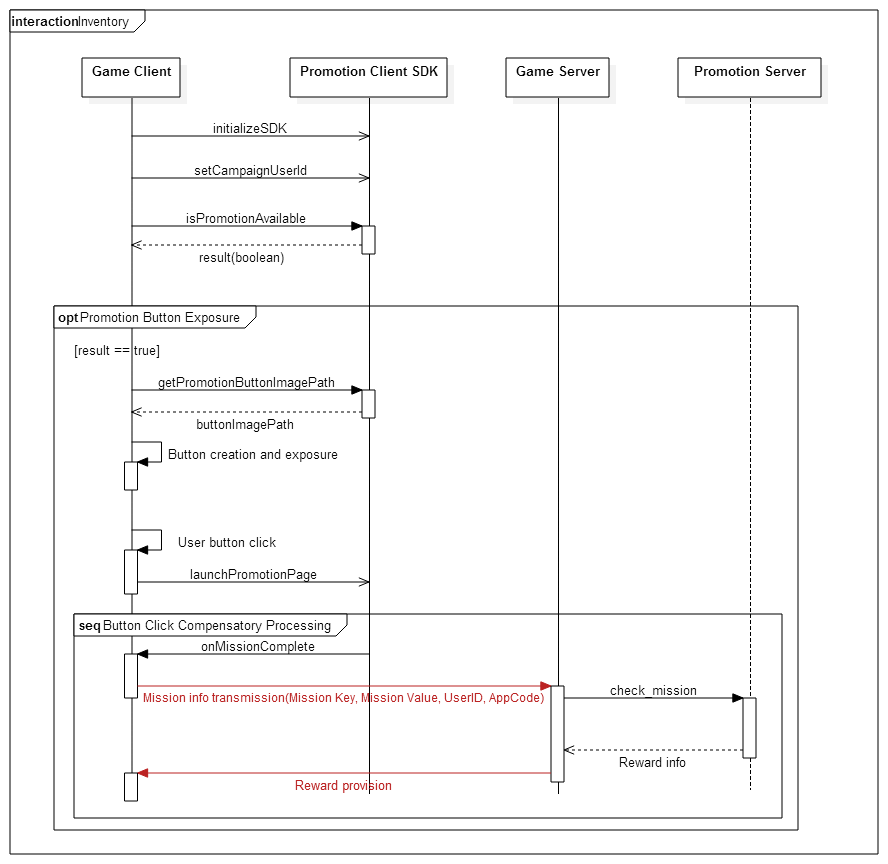
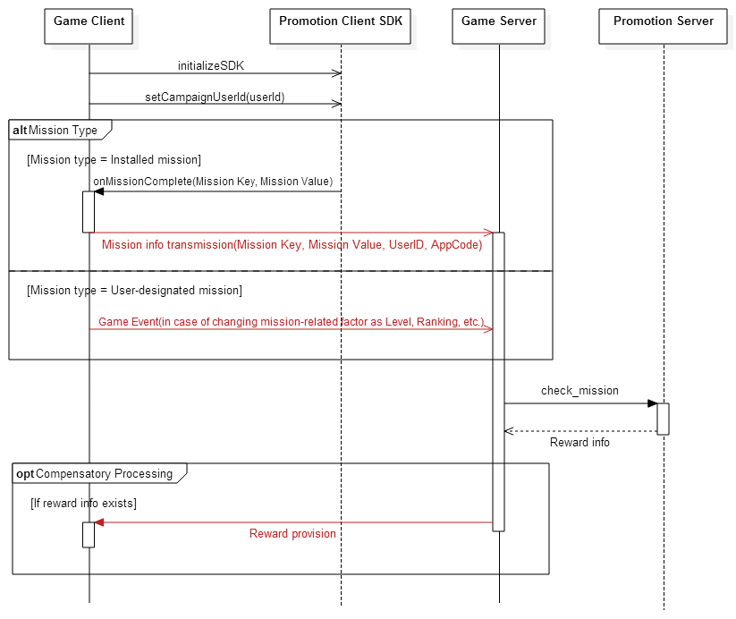

## 推广展示（Inventory）的工作流程

### 推广展示序列号（Sequence）

作为Inventory游戏，推广展示Sequence如下：



[推广展示序列号]


### 游戏客户端的开发

#### 1. 展示推广图标

先调用SDK提供的初始化函数和设置用户账号的函数。
为了展示推广图标，需要先确认当前是否处于可展示推广的状态，然后再调用isPROMOTIONAvailable函数，就能确认到其状态。
查询状态的函数返回为true时，就表示可以展示推广，并在适当位置生成按键即可，按键图片路径可以通过getPROMOTIONButtonImagePath函数获得。
当点击按键时，为了能够展示推广模板，在客户端需要对点击事件进行处理，且发生点击事件时，调用 launchPROMOTIONPage函数，就能展示推广模板了。

#### 2. 奖励处理方案

（针对Analytics In App Campaign，已经做好了奖励处理方案，就无需追加其他步骤了。）
向点击推广图标的用户，每日仅限发放一次奖励。
产生奖励时，SDK向客户端调用onMissionComplete回调函数，同时传送任务密钥和任务值。

```
* 如果是PROMOTION里指定的任务信息，那么为了与游戏任务进行区分，任务密钥值将以‘*’开始。
```
 
### 游戏服务器的开发

#### 1. 奖励处理方案


与推广相关的游戏服务器的主要工作是奖励的处理。
出现如下情况时，游戏服务器使用PROMOTION Server来调用check-mission API之后，应对任务完成情况进行确认。
正在进行推广时，与任务设置有关的因素（在游戏中对Level、Ranking、游戏运行次数等已指定的值）出现变化的情况
在PROMOTION中接收到了事先指定的任务信息的情况（例：APP安装任务、点击推广图标的任务）

```
* 如果是PROMOTION里指定的任务信息，那么为了与游戏任务进行区分，任务密钥值将以‘*’开始。
```
 
在PROMOTION Server中调用check-mission API时，如果有奖励就会获得奖励代码，然后将需要发放的奖励向游戏
客户端传送，该处理需在游戏内完成。 
（使用回复数据的rewardList  field，传送奖励信息，且仅发送一次。）


游戏服务器调用的任务完成通知API的格式如下：


```
Host: https://api-campaign-analytics.cloud.toast.com
POST /campaign/v1/server/check-mission
Content-Type: application/json

{
  "header":
  {
    "transactionId" : 92348729384729,
  },
  "userId" : "23948234",
  "appId" : "13",
  "missionKey" : "LEVEL",
  "missionValue" : 10
}
```

| 名称        | 资料型          | 说明          |
|-------------|----------------|----------------|
| transactionId | int64 | 为了跟踪请求事宜，在Logging时使用，但不是必需值。在这里输入的值，也同样会在回复数据的transactionId field中完成设置后返回。 |
| userId | string | 游戏中提供的用户唯一账号（unique ID）| 
| appId | String | 注册APP时获得的APP账号。输入【APP设置】>【Appkey】值即可。|
| missionKey | string | 表示定义特定行为的密钥值或是通过onMissionComplete(SDK)接收到的值。进入【APP设置】>【活动设置】>【任务及奖励道具的设置】后，所注册的任务密钥值|
| missionValue | int64 | 表示missionKey值|

```
HTTP/1.1 200 OK

{
  "header" :
  {
    "transactionId" : 92348729384729,
    "isSuccessful" : "false",
    "resultcode" : 9001,
    "resultMessages" : ["Invalid input parameter.", "..."],
    "serviceCode" : 10
  },
  "rewardList" : [
    {
      "campaignId" : 7,
      "promoDateBegin" : "2014-10-10 00:00:00",
      "promoDateEnd" : "2014-10-11 00:00:00",
      "rewardDateBegin" : "2014-10-10 00:00:00",
      "rewardDateEnd" : "2014-10-12 00:00:00",
      "rewardCode" : "gem",
      "rewardValue" : 100
    },
    ...
  ]
}
```

| 名称   | 资料型    | 说明 |
|--------|----------|---------|
| transactionId | int64 | 使用请求时接收到的transactionId，进行设置。|
| isSuccessful | string | 设置执行成功与否。（成功：“true”、失败：“false”）| 
| resultCode | int | 编写返回代码。（成功时为0） |
| resultMessages | vector<string> | 编写复数数组的返回信息。 |
| serviceCode | int | 表示服务代码 |
| campaignId | int | 表示有奖励的活动账号 |
| promoDateBegin | 表示活动开始时间（以UTC+0为基准） | 
| promoDateEnd | string | 表示活动结束时间（以UTC+0为基准） | 
| rewardDateBegin | string | 表示奖励开始时间（以UTC+0为基准） | 
| rewardDateEnd | string | 表示奖励结束时间（以UTC+0为基准）| 
| rewardCode | string | 表示奖励代码 |
| rewardValue | int | 表示奖励值 |

## 推广目标的工作流程（Workflow）

### 推广目标序列号（Sequence）

作为目标游戏，推广序列号如下：



[推广目标序列号]


### 游戏客户端的开发

#### 奖励处理方案

（针对Analytics In App Campaign，已经做好了奖励处理方案，就无需追加其他步骤了。）
作为推广目标游戏，在客户端所要进行的主要工作是任务传送和奖励的处理。
发生奖励时，SDK向客户端调用onMissionComplete回调函数（Callback），同时传送任务密钥和任务值。
该值是处理奖励时，游戏服务器所需的值，因此必须要传送给游戏服务器，传送方法可以在游戏内任意创建。

```
* 如果是PROMOTION里指定的任务信息，那么为了与游戏任务进行区分，任务密钥值将以‘*’开始。
```
 
### 游戏服务器的开发

#### 奖励处理方案

与推广相关的游戏服务器的主要工作就是奖励的处理。
出现如下情况时，游戏服务器使用PROMOTION Server来调用check-mission API之后，应对任务完成情况进行确认。
正在进行推广时，与任务设置有关的因素（在游戏中对Level、Ranking、游戏运行次数等已指定的值）出现变化的情况
在PROMOTION中接收到了事先指定的任务信息的情况（例：APP安装任务、点击推广图标的任务）

```
* 如果是PROMOTION里指定的任务信息，那么为了与游戏任务进行区分，任务密钥值将以‘*’开始。
```

在PROMOTION Server中调用check-mission API时，如果有奖励就会获得奖励代码，然后将发放的奖励向游戏客户端发送即可，该处理须在游戏内完成。游戏服务器调用的任务完成通知API与推广展示（Inventory）工作流程中的游戏服
务器奖励处理步骤相同。
